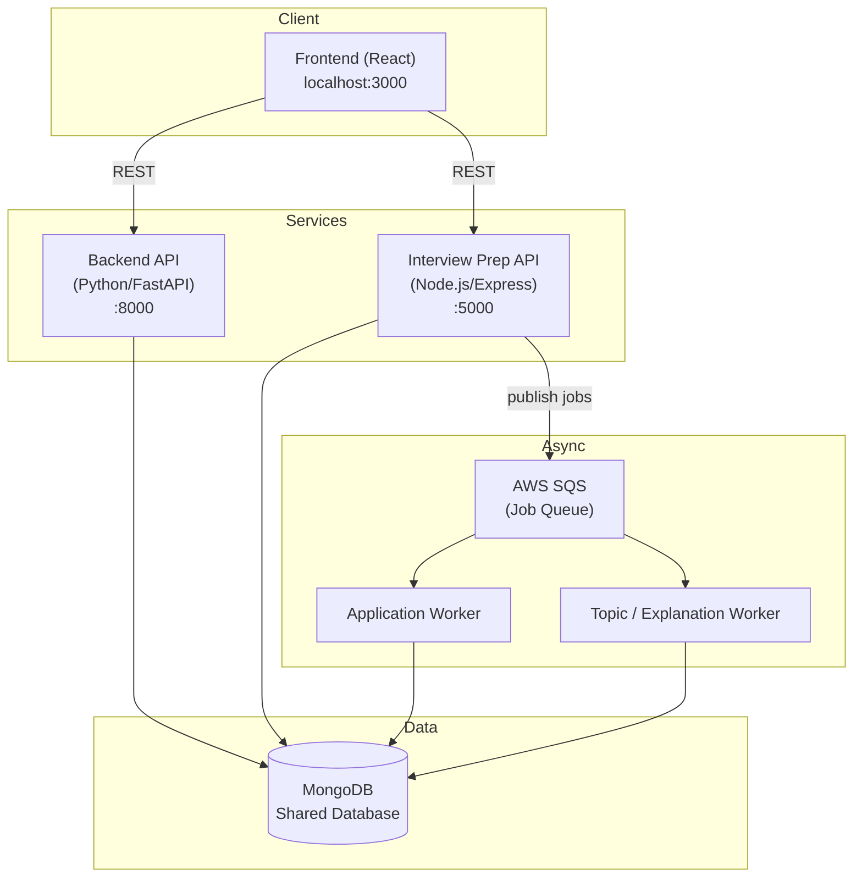
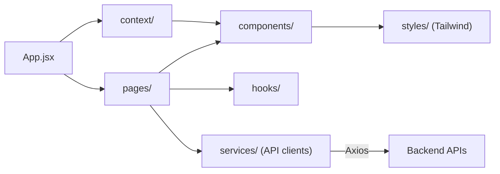
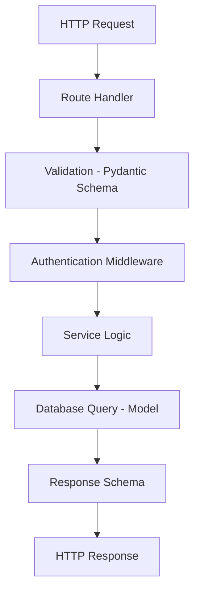
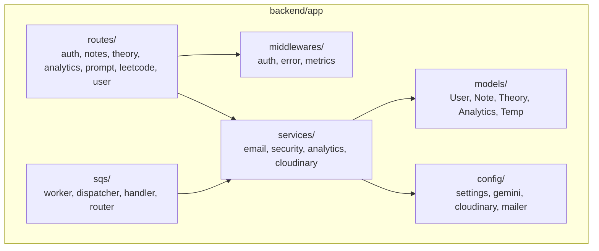
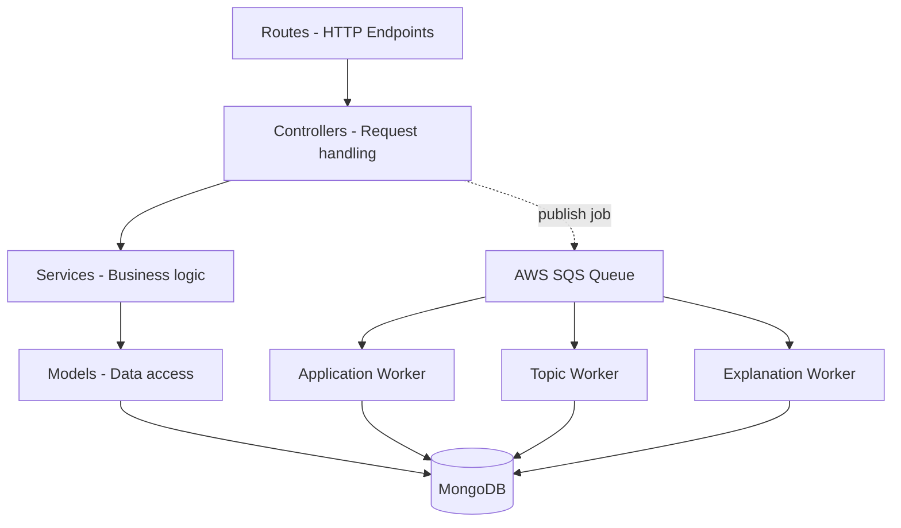
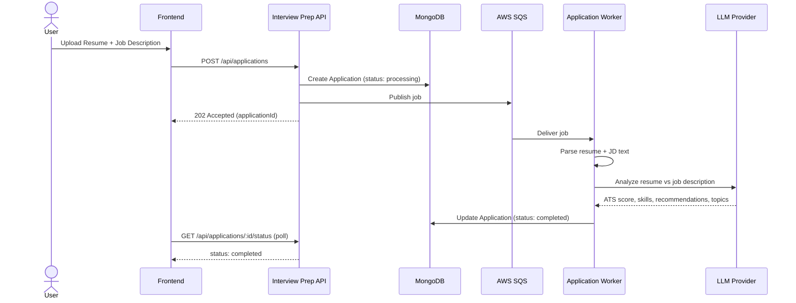
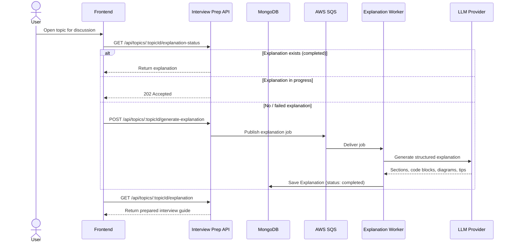
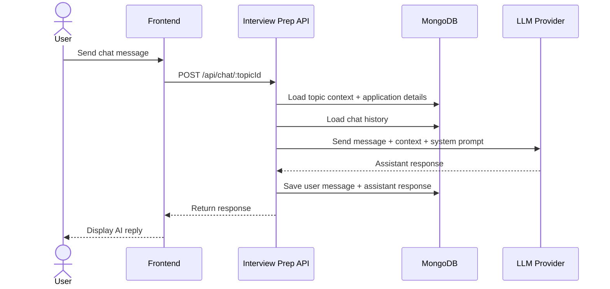
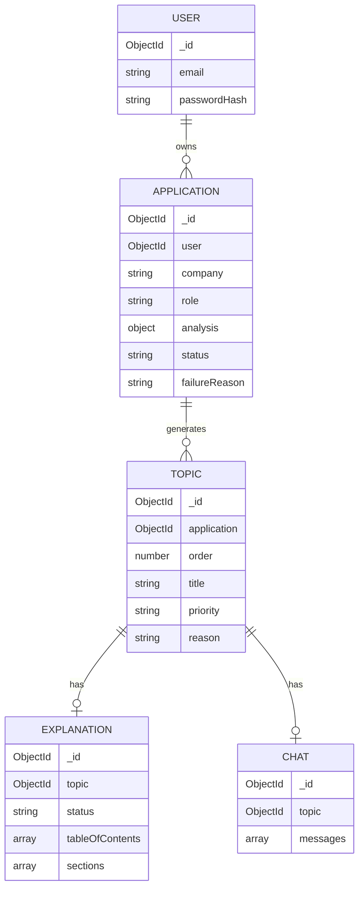
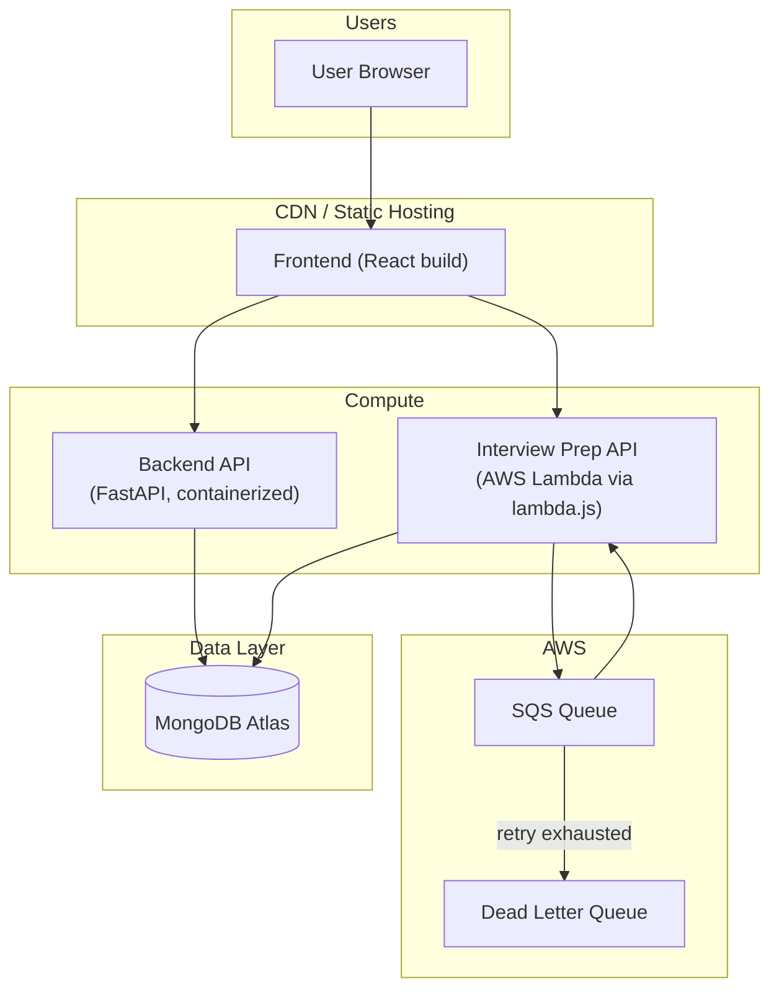

# 🏗️ ALGONOTES - Architecture Documentation

This document describes the technical architecture of ALGONOTES in depth, including system topology, request/data flows, and database relationships.

## Table of Contents
1. [System Overview](#system-overview)
2. [Frontend Architecture](#frontend-architecture)
3. [Backend Architecture (Python/FastAPI)](#backend-architecture-pythonfastapi)
4. [Interview Prep Backend (Node.js/Express)](#interview-prep-backend-nodejsexpress)
5. [Core Flows](#core-flows)
6. [Database Schema & Relationships](#database-schema--relationships)
7. [Deployment Topology](#deployment-topology)

---

## System Overview

ALGONOTES is split into three independently deployable services that share a single MongoDB database and communicate asynchronously via AWS SQS.



---

## Frontend Architecture

**Location**: `frontend/`



**State management**
- React Context API for global app state
- Local component state for UI-specific concerns
- API-level caching for optimized data fetching

---

## Backend Architecture (Python/FastAPI)

**Location**: `backend/`

### Layered request pipeline



### Key components



---

## Interview Prep Backend (Node.js/Express)

**Location**: `interview-prep-backend/`
**Pattern**: MVC with job queue via AWS SQS



### Key directories

```
interview-prep-backend/src/
├── ai/                # AI integration & LLM calls
├── application/        # Application module (model, controller, routes)
├── topic/               # Topic + explanation module
├── chat/                # Chat module
├── jobs/                # BullMQ processors (legacy/alternative)
├── config/              # env, db connection, etc.
├── middlewares/         # auth, error handling
├── sqs/                 # SQS client, publishers, workers/dispatcher
├── prompts/             # LLM prompt templates
├── utils/               # helpers
├── llm/                 # OpenRouter SDK setup + response generation
├── app.js               # Express app setup
├── server.js            # Server entry point
└── lambda.js            # AWS Lambda handler (HTTP + SQS dual mode)
```

---

## Core Flows

### 1. Application Processing Flow



### 2. Topic Explanation Flow



### 3. Chat Flow



---

## Database Schema & Relationships

ALGONOTES uses MongoDB with Mongoose. The core collections relate as follows:



### Indexes

| Collection | Index | Purpose |
|---|---|---|
| Applications | `user: 1, createdAt: -1` | List a user's applications, newest first |
| Applications | `status: 1` | Filter by processing status |
| Applications | `user: 1, status: 1` | Combined user + status queries |
| Topics | `application: 1, order: 1` | Ordered topics within an application |
| Chat | `topic: 1` (unique) | One chat thread per topic |
| Explanations | `topic: 1` (unique) | One explanation per topic |

---

## Deployment Topology



**Notes**
- The Interview Prep API can run either as a long-lived Express server or as an AWS Lambda function (dual mode via `lambda.js`), handling both HTTP requests and SQS-triggered invocations.
- SQS visibility timeout is set to 300 seconds to accommodate long-running LLM calls; a Dead Letter Queue captures messages that fail repeatedly.
- MongoDB Atlas (or a self-hosted MongoDB instance) is shared across both backend services.

---

For API endpoint details, environment variables, and setup instructions, see [`DOCUMENTATION.md`](./DOCUMENTATION.md) and [`README.md`](./README.md).
